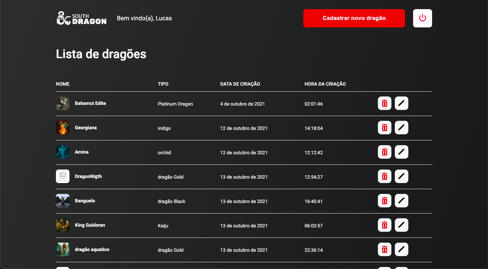

<h1 align="center">
  
</h1>

  
  

 

# South Dragon 

> 🔥 Gerenciador de dragões | Desenvolvimento do *south dragon*, Utilizando React.Js 

## 💻 Projeto

O South Dragon é um gerenciador de dragões, criado com bibliotecas open source,
foi desenvolvido para solucionar um desafio. Nele você consegue cadastrar, visualizar,
excluir e editar um dragão que está sendo consumido pela api do desafio. 🔥

## 🔖 Layout

Você pode visualizar o layout do projeto através [desse link](https://www.figma.com/file/oNO75eQKSs9UbD2vdHFH9q/Untitled?node-id=8%3A73).

---

### 📄 O que foi usado:

- ReactJS
- TypeScript
- useState, useEffect, useCallback
- Styled-Components
- Axios
- React Modal
- Yup

### 🛠 Mão na massa:

> Você pode realizar o clone deste repositório!

Clone o repositório:

`
git clone https://github.com/Lucaslimasz/desafio-frontend-southsystem.git
`

### 💻 Executando o projeto 🚀

#### Na raiz do projeto, execute os comandos:

# Para instalar as dependências
yarn ou npm install

# Para startar o projeto utilize
yarn start ou npm start
`
